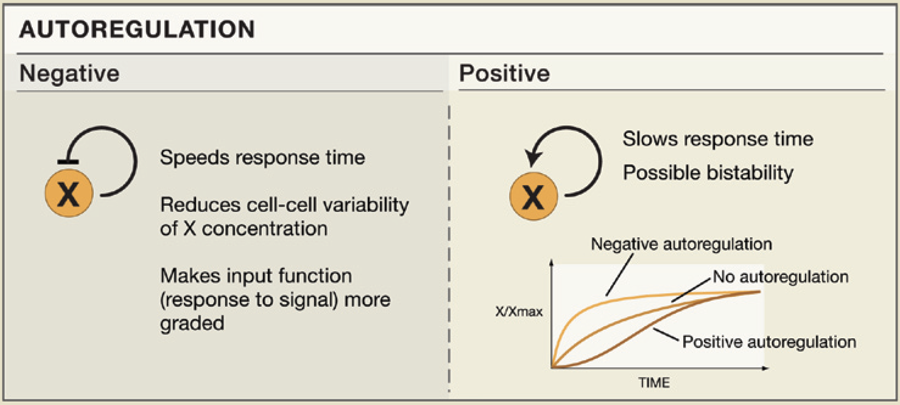

<p align="center">
  
</p>

<h1 align="center">SOORENA</h1>

<p align="center">
  Self-lOOp containing or autoREgulatory Nodes in biological network Analysis
</p>

<p align="center">
  <a href="#introduction">Introduction</a> •
  <a href="#seteup">Setup</a> •
  <a href="#process">Data processing</a> •
  <a href="#contributing">Contributing</a> •
  <a href="#license">License</a>
</p>

---

## 1 Introduction
temp: https://fiaaatlux.shinyapps.io/soorena/

## Self-Loops in Biological Networks

Self-loops represent the simplest form of feedback within a network and can be either positive or negative. Although self-loops are often considered insignificant in static network analyses and consequently ignored in many studies, they play a **critical role** in shaping the dynamics of biological networks. This importance is particularly evident in mathematical models of biological systems—both continuous and discrete ([DOI:10.1529/biophysj.107.125021](https://doi.org/10.1529/biophysj.107.125021)).

[Thomas et al.](https://doi.org/10.1007/BF02460618) demonstrated that:

- **Positive feedback loops** are necessary for **multistationarity**
- **Negative feedback loops** are essential for the **emergence of periodic behavior**

Furthermore, biologists have long recognized that both positive and negative feedback loops are fundamental in regulating the dynamics of a wide range of biological systems (see Figure 1).

When reducing network models for dynamic analysis, most approaches retain **autoregulated nodes**, as their removal would compromise key regulatory properties ([DOI:10.1137/13090537X](https://doi.org/10.1137/13090537X)). Moreover, complex feedback loops involving multiple nodes are often reduced to **self-loops** in simplified versions of the network. These self-loops are crucial for predicting the system’s dynamical behavior ([DOI:10.1016/j.jtbi.2011.08.042](https://doi.org/10.1016/j.jtbi.2011.08.042)).

---

### 🔁 Types of Autoregulation

#### Negative Autoregulation (NAR)

- Accelerates the response time of gene circuits  
- Reduces intercellular variation in protein levels caused by fluctuations in production rates  
- Occurs when:
  - A transcription factor represses its own gene
  - A protein inhibits its own activity (e.g., via autophosphorylation)

#### Positive Autoregulation

- Increases variability and delays response times  
- Under sufficient cooperativity, may lead to **bimodal (all-or-none)** distributions  
- Occurs when:
  - A transcription factor enhances its own production
  - A protein activates its own function through autophosphorylation

---

### 🎯 Project Goal

To the best of our knowledge, no existing database specifically focuses on **self-loops**—neither in the context of signaling pathways nor gene regulatory networks.

This project aims to develop a **text-mining-based approach** to extract, integrate, and catalog information about self-loops in molecular biology.

---

### 📊 Figure

  
*Adapted from: [SnapShot: Network Motifs](https://doi.org/10.1016/j.cell.2010.09.050), Oren Shoval & Uri Alon, Cell, 2010.*


## 2 Setup

Create and activate environment:

```bash
conda env create -f environment.yml
conda activate autoregulatory
```

Install dependencies:

```bash
pip install -r requirements.txt
```
 
## 3 Process

1. Data preparation

```bash
python prepare_data.py
```


2. Train Stage 1 (~30 min):

```bash
python train_stage1.py
```

3. Train Stage 2 (~40 min):

```bash
python train_stage2.py
```

4. Generate reports:

```bash
python evaluate.py
```

5. Test prediction:

```bash
python predict.py
```


6. Create results/unseen_predictions.csv for unseen data prediction:

```bash
python batch_predict.py
```


7. Merge Predictions for final submission:

```bash
python merge_predictions.py
``` 

8. Run Shiny App

```bash
cd ~/Desktop/SOORENA_2/shiny_app
Rscript -e "shiny::runApp('app.R')"
```